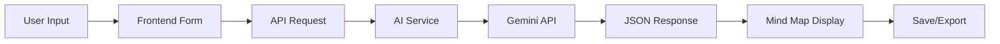

<div align="center">

# 🧠✨ AI Thought Map

**Transform your ideas into beautiful, structured mind maps with AI**

[](https://www.typescriptlang.org/)
[](https://reactjs.org/)
[](https://vitejs.dev/)
[](https://workers.cloudflare.com/)
[](https://ai.google.dev/)

*Powered by Google Gemini AI • Built with Redwood SDK • Deploy on Cloudflare*

---

</div>

## 📋 Table of Contents

- [✨ Features](#-features)
- [🚀 Quick Start](#-quick-start)
- [📖 Usage Guide](#-usage-guide)
- [🏗️ Architecture](#️-architecture)
- [⚙️ Configuration](#️-configuration)
- [🎨 Customization](#-customization)
- [🛠️ Technologies](#️-technologies)
- [🐛 Troubleshooting](#-troubleshooting)
- [📚 Resources](#-resources)

---

## ✨ Features

<div align="center">

| Feature | Description |
|---------|-------------|
| 🤖 **AI-Powered** | Generate mind maps instantly using Google Gemini AI |
| 🎨 **Beautiful UI** | Modern, responsive design with smooth gradients |
| 💾 **Save & Load** | Save your mind maps locally and load them anytime |
| 📤 **Export Options** | Export as PNG, PDF, or copy to clipboard |
| 🔄 **Real-time** | Fast generation with loading states and error handling |
| 📱 **Responsive** | Works perfectly on desktop, tablet, and mobile |

</div>

### 🎯 What You Can Do

- ✍️ **Enter any idea, problem, or question**
- 🧠 **Get AI-generated mind maps** with organized branches
- 💡 **Explore complex topics** broken down into digestible parts
- 📊 **Visualize relationships** between concepts
- 🎨 **Export and share** your mind maps

---

## 🚀 Quick Start

### Prerequisites

- **Node.js** 18+ ([Download](https://nodejs.org/))
- **npm** (comes with Node.js)
- **Google Gemini API Key** ([Get it free](https://aistudio.google.com/app/apikey))

### Installation

#### 1️⃣ Clone and Install

```bash
# Clone the repository
git clone <your-repo-url>
cd ai-thought-map

# Install dependencies
npm install
```

#### 2️⃣ Get Your API Key

1. Visit [Google AI Studio](https://aistudio.google.com/app/apikey)
2. Sign in with your Google account
3. Click **"Create API Key"**
4. Copy your API key

#### 3️⃣ Configure Environment

Create a `.dev.vars` file in the project root:

```bash
# .dev.vars
GEMINI_API_KEY=your-api-key-here
```

> 💡 **Tip:** Copy `.dev.vars.example` and replace the placeholder with your actual key.

#### 4️⃣ Start Development Server

```bash
npm run dev
```

Open your browser and navigate to the URL shown in the terminal (usually `http://localhost:5173`).

---

## 📖 Usage Guide

### Basic Usage

1. **Enter your topic** in the text area
   ```
   Example: "How can I improve my productivity?"
   ```

2. **Click "Generate Map"** and wait 2-5 seconds

3. **View your mind map** with:
   - Central idea at the top
   - Main branches organized in a grid
   - Sub-branches with detailed points

4. **Save or Export** your mind map:
   - 💾 Auto-saved to browser storage
   - 📤 Export as PNG or PDF
   - 📋 Copy to clipboard

### Example Queries

Try these to get started:

```
✨ "Starting a sustainable business"
📚 "Learning web development from scratch"
🏃 "Healthy lifestyle habits for busy professionals"
✈️ "Planning a trip to Japan"
💼 "Career development strategies"
🎯 "Goal setting and achievement"
```

### Saved Maps

- **View saved maps** by clicking the "Saved" section
- **Load** any previous mind map with one click
- **Delete** individual maps or clear all
- **Import/Export** your collection as JSON

---

## 🏗️ Architecture

### Project Structure

```
ai-thought-map/
├── 📁 src/
│   ├── 📁 app/
│   │   ├── 📁 api/
│   │   │   └── generate-mindmap.ts      # API endpoint
│   │   ├── 📁 components/
│   │   │   ├── ThoughtMapForm.tsx      # Main form & state
│   │   │   ├── MindMapVisualization.tsx # Mind map display
│   │   │   └── SavedMaps.tsx            # Saved maps UI
│   │   ├── 📁 pages/
│   │   │   └── Home.tsx                  # Home page
│   │   └── 📁 styles/
│   │       └── main.css                  # App styles
│   ├── 📁 services/
│   │   ├── ai.ts                         # Gemini API integration
│   │   ├── storage.ts                    # LocalStorage service
│   │   └── export.ts                     # Export utilities
│   ├── 📁 types/
│   │   └── mindmap.ts                    # TypeScript types
│   ├── worker.tsx                        # Worker/router config
│   └── main.tsx                          # Entry point
├── 📄 .dev.vars                          # Environment variables
├── 📄 vite.config.mts                    # Vite configuration
└── 📄 wrangler.jsonc                     # Cloudflare config
```

### How It Works



#### 🔄 Request Flow

1. **Frontend** (`ThoughtMapForm.tsx`)
   - User enters text
   - Sends POST to `/api/generate-mindmap`
   - Manages loading/error states

2. **API Route** (`generate-mindmap.ts`)
   - Validates request
   - Calls AI service
   - Returns structured JSON

3. **AI Service** (`ai.ts`)
   - Crafts prompt for Gemini
   - Sends request with JSON mode
   - Parses and validates response

4. **Visualization** (`MindMapVisualization.tsx`)
   - Renders central idea
   - Displays branches in grid
   - Provides export options

### AI Prompt Structure

The system uses a carefully engineered prompt:

```typescript
{
  "centralIdea": "Main topic",
  "branches": [
    {
      "title": "Branch name",
      "subBranches": ["Point 1", "Point 2", "Point 3"]
    }
  ]
}
```

**Example Output:**

```json
{
  "centralIdea": "How can I improve my productivity?",
  "branches": [
    {
      "title": "Time Management",
      "subBranches": [
        "Use time-blocking techniques",
        "Prioritize tasks with Eisenhower Matrix",
        "Set realistic deadlines"
      ]
    },
    {
      "title": "Focus & Concentration",
      "subBranches": [
        "Eliminate distractions",
        "Practice deep work sessions",
        "Take regular breaks (Pomodoro)"
      ]
    }
  ]
}
```

---

## ⚙️ Configuration

### Environment Variables

#### Development (`.dev.vars`)

```bash
# Required
GEMINI_API_KEY=your-api-key-here

# Optional: Change AI model
GEMINI_MODEL=gemini-1.5-pro
```

#### Production (Cloudflare Dashboard)

1. Go to **Workers & Pages** → Your Worker → **Settings**
2. Navigate to **Variables**
3. Add `GEMINI_API_KEY` with your API key value

### Available Models

| Model | Speed | Quality | Best For |
|-------|-------|---------|----------|
| `gemini-2.0-flash-exp` | ⚡⚡⚡ | ⭐⭐⭐ | **Default** - Balanced |
| `gemini-1.5-pro` | ⚡⚡ | ⭐⭐⭐⭐ | Best quality |
| `gemini-1.5-flash` | ⚡⚡⚡⚡ | ⭐⭐ | Speed priority |

### Changing the Model

**Option 1:** Edit `src/services/ai.ts`

```typescript
model: string = "gemini-1.5-pro" // Change default model
```

**Option 2:** Use environment variable

```bash
# .dev.vars
GEMINI_MODEL=gemini-1.5-pro
```

---

## 🎨 Customization

### Styling

Edit `src/app/styles/main.css` to customize:

- 🎨 **Colors & Gradients** - Lines 8, 137
- 📐 **Layout & Spacing** - Adjust padding/margins
- 🔤 **Typography** - Font families and sizes
- 📱 **Responsive Breakpoints** - Media queries

### Theme Colors

Current gradient: `#667eea` → `#764ba2`

```css
/* Main gradient */
background: linear-gradient(135deg, #667eea 0%, #764ba2 100%);
```

### Adding Features

The codebase is modular and easy to extend:

- **New export formats** → `src/services/export.ts`
- **Storage options** → `src/services/storage.ts`
- **AI prompts** → `src/services/ai.ts`
- **UI components** → `src/app/components/`

---

## 🛠️ Technologies

<div align="center">

| Category | Technology |
|----------|-----------|
| **Framework** | Redwood SDK, React 19 |
| **Language** | TypeScript |
| **Build Tool** | Vite 7 |
| **Runtime** | Cloudflare Workers |
| **AI** | Google Gemini API |
| **Styling** | Tailwind CSS, Custom CSS |
| **Export** | html2canvas, jsPDF |

</div>

### Why These Technologies?

- ⚡ **Vite** - Lightning-fast development
- 🚀 **Cloudflare Workers** - Edge computing, global deployment
- 🧠 **Gemini AI** - Free tier, excellent JSON mode
- ⚛️ **React 19** - Latest features, great DX
- 📘 **TypeScript** - Type safety, better IDE support

---

## 🐛 Troubleshooting

### Common Issues

#### ❌ API Key Not Found

**Problem:** `Error: Gemini API key not configured`

**Solutions:**
1. ✅ Check `.dev.vars` exists in project root
2. ✅ Verify `GEMINI_API_KEY=your-key` (no quotes, no spaces)
3. ✅ Restart dev server after adding key
4. ✅ Check terminal for "✓ Loaded API key from .dev.vars"

#### ❌ Rate Limit Exceeded

**Problem:** `429 Too Many Requests`

**Solutions:**
- ⏱️ Wait 1 minute (free tier: 15 req/min)
- 🔄 Upgrade to paid tier for higher limits
- 💡 Use `gemini-1.5-flash` for faster, cheaper requests

#### ❌ Invalid Response Format

**Problem:** AI returns malformed JSON

**Solutions:**
- ✅ Verify API key is valid
- 🔄 Try a different model (`gemini-1.5-pro`)
- 📝 Check browser console for detailed errors

#### ❌ TypeScript Errors

**Problem:** Red squiggles in IDE

**Solutions:**
```bash
# Generate types
npm run generate

# Or restart dev server
npm run dev
```

#### ❌ Port Already in Use

**Problem:** `Port 5173 is already in use`

**Solutions:**
- 🔄 Vite will auto-use next available port (5174, 5175...)
- 🛑 Or close the process using the port

---

## 📚 Resources

### Documentation

- 📖 [Redwood SDK Docs](https://docs.rwsdk.com/)
- ☁️ [Cloudflare Workers Docs](https://developers.cloudflare.com/workers)
- 🤖 [Google Gemini API Docs](https://ai.google.dev/docs)
- ⚡ [Vite Documentation](https://vitejs.dev/)

### Getting API Keys

- 🔑 [Get Gemini API Key](https://aistudio.google.com/app/apikey) - Free tier available!

### Community

- 💬 [Redwood SDK Discord](https://discord.gg/redwoodjs)
- 🐦 [Cloudflare Community](https://community.cloudflare.com/)

---

## 📝 License

This project is licensed under the **MIT License**.

---

<div align="center">

**Made with ❤️ using AI**

[⭐ Star on GitHub](https://github.com) • [🐛 Report Bug](https://github.com) • [💡 Request Feature](https://github.com)

---

*Transform your thoughts into visual knowledge maps*

</div>
